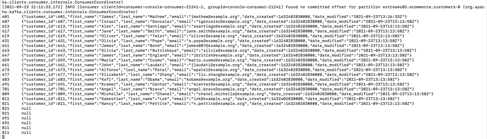

## Debugging Avro Topics

To debug the Avro topics in our setup lets use the following commands

We can use the same command for each of the topics we are exploring:

- estreams65.ecommerce.customers
- estreams75.ecommerce.customers
- estreams85.ecommerce.customers

I decided to create three separate topics to illustrate some of the setup differences for the Kafka Connect configuration.

The first topic, **estreams65.ecommerce.customers** is the original setup capturing CDC changes from the MySQL Debezium Connector in is raw and original form.

The second topic, **estreams75.ecommerce.customers** is the modified setup capturing CDC changes from the MySQL Debezium Connector where SMTs (single message transforms) are leveraged to extract the topic keys from the value of the event. However, this has a problem with tombstone records when these values are null and could cause the Connector Task to crash and halt the process.

The third topic, **estreams85.ecommerce.customers** leverages the configuration from the second setup but adds an additional constraint known as predicates, which applies the SMTs on a conditional basis and only to events which satisfies a specific condition. In this config, we use the "RecordIsTombstone" predicate which is true for records that are tombstones. Then we apply the negate property so that we only apply our SMT on records that are not tombstones.

```bash

docker exec -it schema-registry /bin/bash
  
# The avro console producers/consumers are available in /usr/bin
cd /usr/bin

# List the contents of the directory
ls -l /usr/bin/kafka-*

# Use this to browse the events in a topic
/usr/bin/kafka-avro-console-consumer --bootstrap-server node1:9092  --from-beginning --property print.key=true --property schema.registry=http://schema-registry:8081 --topic estreams85.ecommerce.customers

# Use the Avro Console Consumer to see the latest (starting from the most recent/newest offset) data in the  topics
/usr/bin/kafka-avro-console-consumer --bootstrap-server node1:9092 --key-deserializer org.apache.kafka.common.serialization.IntegerDeserializer --property print.key=true --property schema.registry=http://schema-registry:8081 --topic estreams85.ecommerce.customers

# Use the Avro Console Consumer to see the latest (starting from the earliest/oldest offset) data in the  topics

/usr/bin/kafka-avro-console-consumer --bootstrap-server node1:9092 --key-deserializer org.apache.kafka.common.serialization.IntegerDeserializer --property print.key=true  --from-beginning --property schema.registry=http://schema-registry:8081 --topic estreams85.ecommerce.customers


/usr/bin/kafka-avro-console-consumer --bootstrap-server node1:9092  --from-beginning --property schema.registry=http://schema-registry:8081 --topic estreams85.ecommerce.customers

```


