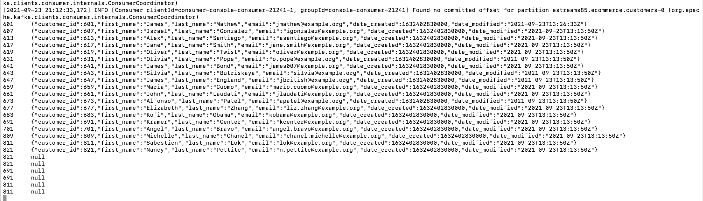

# Kafka-Powered Realtime Search

Welcome. In this tutorial, we walk you through how to use Kafka Connect to sync up datastores with your search stores such as ElasticSearch.

## Setting up the Relative Volumes for Kafka and MySQL

Navigate to the compose/kraft directory and create folders that will be mounted as volumes in the docker compose scripts. 

We need to create the following data directories inside the compose/kraft folder/directory:

- mysql-data
- kafka-data

These folders will be used for storing the local Kafka data and MySQL data.

```bash

# Navigate to the KRaft folder
cd compose/kraft

# Run this command to reset the data directories
# Removes any prexisting data directory for MySQL and Kafka, if it already exists
# Creates the data directories for MySQL and Kafka if it does not exist
./reset-data.sh

```

Note: If you are working on non-UNIX systems other than Linux or Mac OS X, please manually remove and recreate these directories.

## Booting Up the Cluster

```bash

# Run this command to boot up the cluster
docker-compose up

# Run this command to shut down and clean up
docker-compose down --remove-orphans

```

## Loading Up the Data

Once the Docker compose instances are up and running, we now need to load the data

We have the following SQL scripts in the datasets/MySQL directory

- MySQL.0.Setup.sql (used to set up the credentials and databases)
- MySQL.1.DDL.sql (contains the data definition language for creating the customers table)
- MySQL.2.DML.sql (contains the data manipulation language for SELECTs, INSERTs, UPDATEs, and DELETEs on the customers table)


These SQL scripts will be used to interact with the data that will generate CDC (change-data-capture) events for our demonstration.

The CDC changes will be picked up by the Debezium Kafka Connect Source connector and pushed into our Kafka broker. When rows are deleted, tombstone records (events with defined keys but null values) will be created and sent into the topics to indicate that those records should be removed from the ElasticSearch instance.

We can use the commands available in the [connect debug script](KAFKA-CONNECT-DEBUG.md) to watch changes that are happening in the Kafka topics.



INSERTs and UPDATEs will create and update ElasticSearch documents. DELETE statements will generate tombstone records that will cause the ElasticSearch Sink connector to remove documents with those ids from the Search indices.


## Debugging and Watching the Topics

Let's use the commands available in the [connect debug script](KAFKA-CONNECT-DEBUG.md) to watch changes that are happening in the Kafka topics.

## Setting up Postman

Inside the datasets/Postman directory, the "Kafka-Powered DB-Search Sync.json" Postman script gives you HTTP requests to interact with the following components

- Confluent REST Proxy
- Confluent Schema Registry
- Kafka Connect Instances
- ElasticSearch instance


## References

[Kafka Connect Documentation](https://kafka.apache.org/documentation.html#connect)

[MySQL Debezium Source Connector](https://debezium.io/documentation/reference/connectors/mysql.html#how-the-mysql-connector-works)

[ElasticSearch Sink Connector](https://docs.confluent.io/kafka-connect-elasticsearch/current/overview.html#configuration-properties)

[Apache Kafka SMTs](https://docs.confluent.io/platform/current/connect/transforms/overview.html)

[Apache Kafka Connect Predicates](https://docs.confluent.io/platform/current/connect/transforms/filter-ak.html)

[ElasticSearch Search Documentation](https://www.elastic.co/guide/en/elasticsearch/reference/current/search-search.html#search-search-api-request)

[ElasticSearch Search Query Samples via CURL](ELASTICSEARCH.md)

[Kafka Console Consumer Samples](KAFKA-CONNECT-DEBUG.md) 
